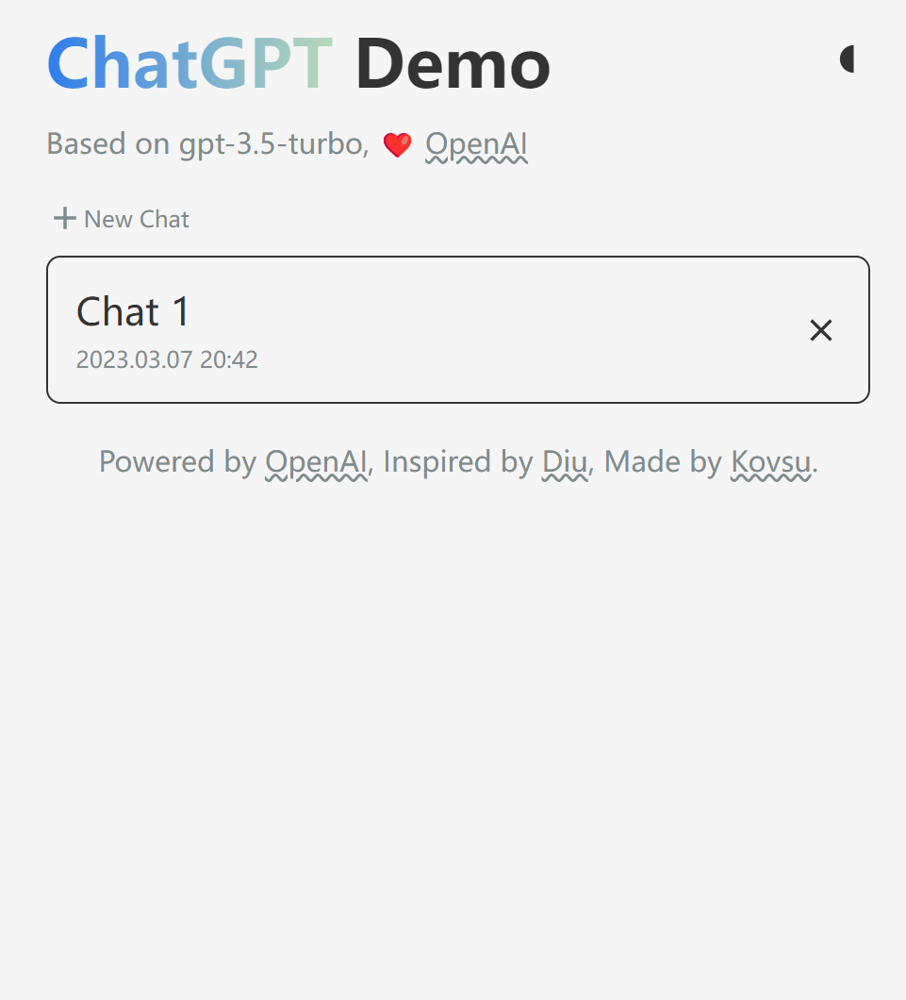
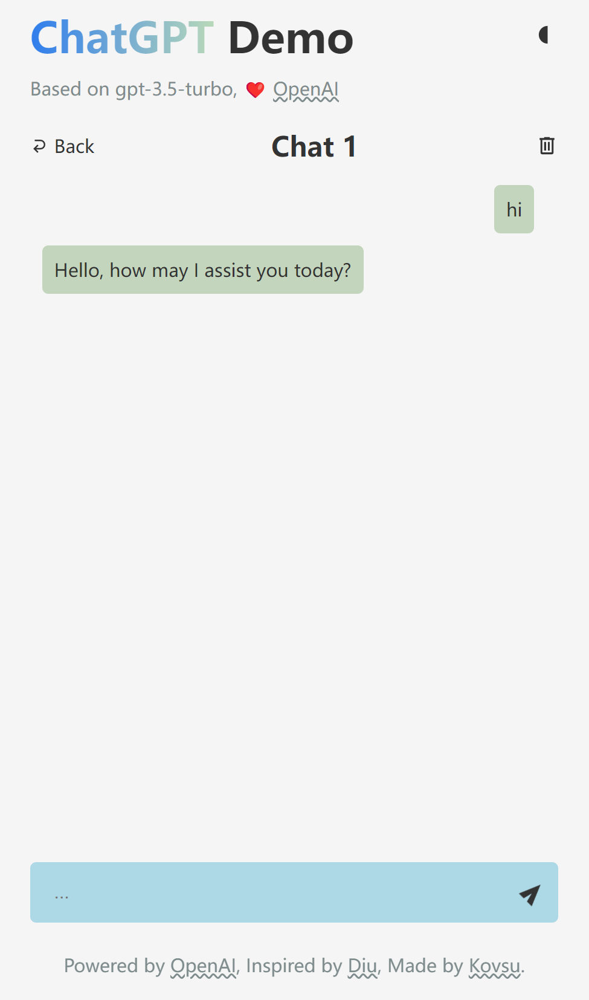

## ChatGpt Demo
This is a demo project that showcases the capabilities of the ChatGpt API. It is built using Vue.js and provides a simple chat interface for interacting with the ChatGpt API.

### Project setup

1. Clone the repository and navigate to the project directory:

```bash
git clone https://github.com/kovsu/ChatGPT-demo.git

cd chatgpt-demo
```

2. Install dependencies:

```bash
npm install
```

3. Create a .env file in the project root and add your OpenAI API key:

```bash
VITE_OPENAI_API_KEY=your_api_key_here
```

Note: If you don't have a Open API key yet, you can sign up for one at [api-keys](https://platform.openai.com/account/api-keys).


### Usage

Once the app is running, you can start chatting with the ChatGpt API by typing your messages into the input field at the bottom of the screen and pressing Enter. The API will respond with a generated message, which will be displayed in the chat history above.

### Screenshots
 


### Deploy

```bash
npm run build
```

Drop the dist folder to [netlify](https://app.netlify.com/drop).


### License

This project is licensed under the MIT License. See the LICENSE file for more information.
